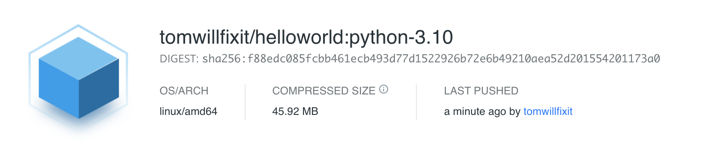
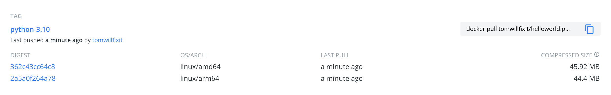

# Build and Run a Multi-Arch Python App 


This [blog post](https://medium.com/devops-dudes/migrating-a-dockerized-gitlab-chat-bot-to-arm-in-an-afternoon-9324dc43480d) covers some of the reasons why you may want to run your Python app or containerized tooling on a different architecture. The primary reason is that with a few changes to the docker build instructions you can run your containers at a fraction of the cost on ARM based instances in AWS.


# Let's get started ...

We are going to follow some of these [instructions](https://docs.docker.com/language/python/build-images) and create a docker image for our Python app which will be able to run on amd64 and arm64 without any code changes.  The steps below are being run on Docker Desktop (v4.3.1) on MacOS.


# Step 1 : Build a basic python app

Checkout the code from this repository (or just copy the Dockerfile and requirements.txt) and run :
```
docker build -t helloworld .
```

Let's start the app and verify it works :

```
docker run --publish 5000:5000 helloworld
curl localhost:5000
```

Check architecture of the image we just built : 

This command requires [jq](https://stedolan.github.io/jq/) to be installed. jq is an incredibly useful tool to have in your toolkit.
```
docker inspect helloworld |jq -r '.[].Architecture'
```

# Step 2 : Push image to DockerHub

In this step I'm going to login to my DockerHub account and push the image. If you don't have an account you can can create one [here](https://hub.docker.com/) for free. After creating your account you'll need to replace the "tomwillfixit" string below with your DockerHub username.

```
Login to DockerHub : docker login

docker tag helloworld tomwillfixit/helloworld:python-3.10

docker push tomwillfixit/helloworld:python-3.10
```

We can see in DockerHub that the image we just pushed is amd64. Docker build defaults to the base architecture of the host where it is executed.



# Step 3 : Building with Buildx

Now we want to build an image from the same source code but an image that will run on ARM based hardware such as [AWS Graviton2/3](https://aws.amazon.com/ec2/graviton/).

What is buildx?

`It's like docker build on steroids.`

You can learn more about Docker Buildx [here](https://docs.docker.com/buildx/working-with-buildx).

Let's move on and build our multi-arch image.

The next command looks a bit magical : 
```
docker run --privileged --rm tonistiigi/binfmt --install all
```

What does this command do? It's all explained here : https://docs.docker.com/buildx/working-with-buildx/#build-multi-platform-images

tl;dr to build multi-arch images buildx uses QEMU emulation and this command will download some QEMU binaries and other things.

Output looks like :
```

latest: Pulling from tonistiigi/binfmt
2a625f6055a5: Pull complete 
71d6c64c6702: Pull complete 
Digest: sha256:8de6f2decb92e9001d094534bf8a92880c175bd5dfb4a9d8579f26f09821cfa2
Status: Downloaded newer image for tonistiigi/binfmt:latest
{
  "supported": [
    "linux/amd64",
    "linux/arm64",
    "linux/riscv64",
    "linux/ppc64le",
    "linux/s390x",
    "linux/386",
    "linux/mips64le",
    "linux/mips64",
    "linux/arm/v7",
    "linux/arm/v6"
  ],
  "emulators": [
    "qemu-aarch64",
    "qemu-arm",
    "qemu-mips64",
    "qemu-mips64el",
    "qemu-ppc64le",
    "qemu-riscv64",
    "qemu-s390x"
  ]
}


```

Building : 
```
docker buildx build --platform linux/amd64,linux/arm64/v8 --tag tomwillfixit/helloworld:python-3.10 .
```

At this point we have built an image with the "python-3.10" label that will run on amd64 and arm64.

Where the heck is this new image?

```
docker images |grep helloworld
helloworld                                                                latest                                     fa8e8485a9d9   24 minutes ago   126MB                               
tomwillfixit/helloworld                                                   python-3.10                                fa8e8485a9d9   24 minutes ago   126MB
```

The image is stored in the cache of the builder that we created earlier. The builder was called "demo" and we can view the image using this command.
```
docker buildx imagetools inspect tomwillfixit/helloworld:python-3.10
```

Ok let's build again and automatically push our new multi-arch image : 
```
docker buildx build --platform linux/amd64,linux/arm64/v8 --push --tag tomwillfixit/helloworld:python-3.10 .
```

At this point our image has been built for amd64 and arm64. It is automatically pushed to DockerHub.


# Summary

The really nice thing about this approach is that with a few changes to the "docker build" command you can move your apps over to ARM. Whether you are logged into an amd64 or arm64 box you use the same command to start the app : 

```
docker run --publish 5000:5000 tomwillfixit/helloworld:python-3.10
```

You don't need to worry about pulling different labels for different architectures. Docker stores the sha value for each architecture in a manifest file in the image registry and when the user pulls the image the correct image is fetched.
